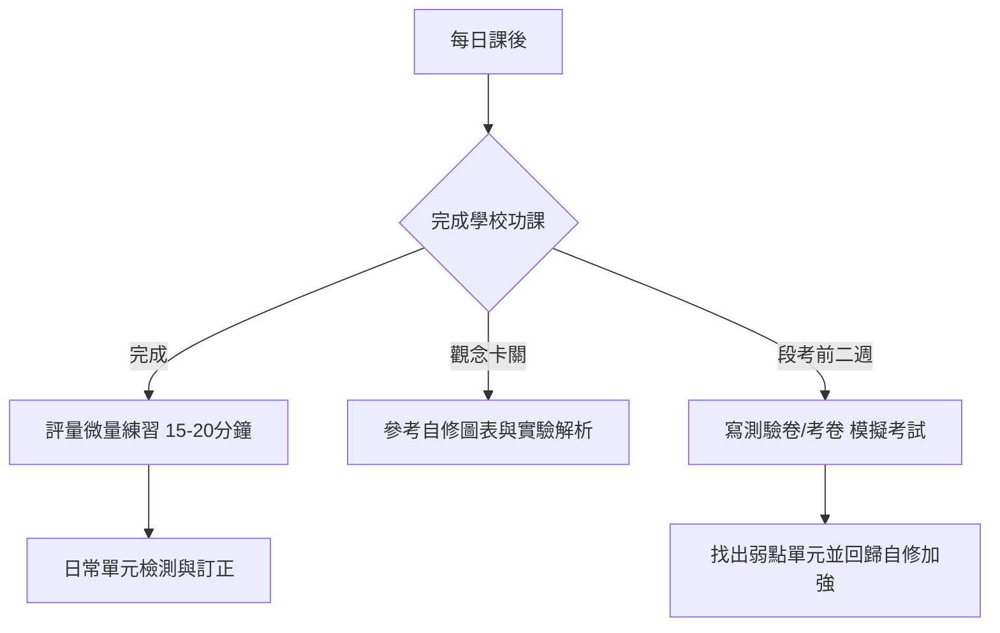

# 邱鈺芯的 115 學年度三年級（小二升小三）重點科目學習教材推薦與規劃

本規劃報告依據 **桃園市潮音國民小學 115 學年度教科書選用版本** 以及 **Gooro 夠了參考書店** 的教材選購指南，針對國語、數學、社會、自然科學、英語等重點科目進行教材推薦。

---

## 1. 學校選用教科書版本確認

經查詢 [潮音國民小學 115 學年度教科書選用版本.pdf](file:///d:/Google%20雲端硬碟-janchen.chiou/潮音國小/潮音國民小學%20115%20學年度教科書選用版本.pdf)，三年級的重點學科版本非常一致，**全部選用「康軒版」**：

| 學科 | 115 學年度選用版本 | 備註 |
| :--- | :--- | :--- |
| **國語文** | **康軒版** | 語文領域核心 |
| **數學** | **康軒版** | 數理思維核心 |
| **社會** | **康軒版** | 中年級新增學科，著重圖表理解與記憶 |
| **自然科學** | **康軒版** | 中年級新增學科，著重實驗步驟與科學概念 |
| **英語文** | **康軒版** | 基礎聽說讀寫，包含日常對話練習 |

> [!IMPORTANT]  
> 購買任何自修、評量、測驗卷時，**務必選擇對應的「康軒版」**，才能與學校的教學進度完全對齊。

---

## 2. 教材種類解析與選購建議 (參考 Gooro 指南)

依據 [Gooro 夠了參考書店教材顧問建議](https://gooro.vip/)，國小中年級的輔材可依學習目的分類：

### A. 自修（適合：觀念預習、實驗圖解、家長指導）
*   **功能**：重點整理最詳細，內含課文詳細注釋、生字筆順、數學解題步驟、社會重點整理與自然實驗步驟圖解。
*   **建議**：因三年級多了「社會」與「自然科學」兩個全新且需要理解觀念的學科，強烈建議購入**社會自修與自然自修**；而國語與數學自修則可協助日常自主學習與預習。
*   **預估單價**：每本約 **$300 ~ 400 元**。

### B. 評量 / 講義式評量（適合：課後練習、單元複習）
*   **功能**：按課本單元設計題目，難易度適中，適合每週或每單元結束後進行自我檢測。
*   **建議**：這是最核心的日常練習本，建議**國語、數學、社會、自然、英語各備一本評量**，作為課後複習。
*   **預估單價**：每本約 **$140 ~ 180 元**。

### C. 測驗卷 / 考卷（適合：段考前衝刺、時間掌控練習）
*   **功能**：大張考卷格式（同學校段考格式），主要用於段考前一至兩週，訓練孩子的答題速度與臨場感。
*   **建議**：因家長提到「測驗卷都要」，建議準備**五科重點科目的測驗卷**。
*   **預估單價**：每份約 **$100 ~ 130 元**。

---

## 3. 重點科目教材推薦清單

家長可依照以下規格於實體書店或 [Gooro 官網](https://gooro.vip/) 選購：

### 📘 國語（學校版本：康軒）
*   **自修**：《康軒學習自修國語 3上》── 用於生字造詞、筆順及成語補充。
*   **評量**：《康軒國語評量 3上》或《康軒國語講義式評量 3上》── 週練與課後複習。
*   **測驗卷**：《康軒國語測驗卷 3上》── 考前模擬。

### 📙 數學（學校版本：康軒）
*   **自修**：《康軒學習自修數學 3上》── 內含課本概念與解題圖解，適合家長引導解題。
*   **評量**：《康軒數學評量 3上》── 單元練習，加強三年級的分數與除法觀念。
*   **計算練習**：《康軒數學計算高手 3上》── 專為計算設計，加強四則運算的速度與精準度（預估單價 **$80 ~ 100 元**）。
*   **測驗卷**：《康軒數學測驗卷 3上》── 考前限時答題模擬。

### 綠色 社會（學校版本：康軒）
*   **自修**：《康軒學習自修社會 3上》── 透過結構化的表格與心智圖，幫助整理家鄉與社會團體之複雜概念。
*   **評量**：《康軒社會評量 3上》── 課後基礎與圖表題型練習。
*   **測驗卷**：《康軒社會測驗卷 3上》── 考前考卷模擬。

### 🔬 自然科學（學校版本：康軒）
*   **自修**：《康軒學習自修自然與生活科技 3上》── 內含詳盡的實驗操作步驟圖解、器材說明與結果歸納。
*   **評量**：《康軒自然評量 3上》── 單元觀念檢測與科學常識應用。
*   **測驗卷**：《康軒自然測驗卷 3上》── 考前模擬衝刺。

### 🔤 英語（學校版本：康軒）
*   **自修**：《康軒學習自修英語 3上》── 單字發音、日常對話解析。
*   **評量**：《康軒英語評量 3上》── 單字書寫與聽力練習。
*   **測驗卷**：《康軒英語測驗卷 3上》── 聽力與基礎讀寫測驗。

---

## 4. 購買品項與預估書費統計

| 教材類型 | 數量 | 預估優惠單價區間 | 小計預算區間 |
| :--- | :---: | :--- | :--- |
| **自修 (五科)** | 5 本 | $300 ~ 400 | $1,500 ~ 2,000 |
| **評量 (五科)** | 5 本 | $140 ~ 180 | $700 ~ 900 |
| **測驗卷 (五科)** | 5 份 | $100 ~ 130 | $500 ~ 650 |
| **額外計算練習** | 1 本 | $80 ~ 100 | $80 ~ 100 |
| **預估總計** | **16 項** | - | **$2,780 ~ 3,650 元** |

---

## 5. 學習時間與教材搭配規劃

為了讓「鈺芯」在小三課業變重的情況下維持良好學習節奏，建議採取以下教材搭配：

*   **平時（週一至週五）**：
    *   以學校功課為主，寫完後再利用**評量**練習 1~2 頁（約 15 分鐘），保持解題敏銳度。
    *   自然、社會等科若課堂聽不懂，當天回家即開啟**自修**看圖解或實驗複習。
*   **週末**：
    *   做為緩衝時間，若有當週不懂的觀念，利用**自修**進行重點釐清與題目練習。
*   **段考前一至二週**：
    *   利用週末或課後時間，限時模擬寫**測驗卷**，習慣考卷字體大小與時間分配，並落實考後檢討錯題。
