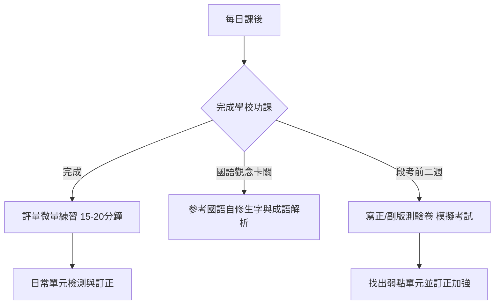

# 邱鈺芯的 115 學年度三年級（小二升小三）重點科目學習教材推薦與規劃

本規劃報告依據 **桃園市潮音國民小學 115 學年度教科書選用版本** 以及 **Gooro 夠了參考書店** 的教材選購指南，針對國語、數學、社會、自然科學、英語等重點科目進行教材推薦。

---

## 1. 學校選用教科書版本確認

經查詢 [潮音國民小學 115 學年度教科書選用版本.pdf](file:///d:/Google%20雲端硬碟-janchen.chiou/潮音國小/潮音國民小學%20115%20學年度教科書選用版本.pdf)，三年級的重點學科版本非常一致，**全部選用「康軒版」**：

| 學科 | 115 學年度選用版本 | 備註 |
| :--- | :--- | :--- |
| **國語文** | **康軒版** | 語文領域核心 |
| **數學** | **康軒版** | 數理思維核心 |
| **社會** | **康軒版** | 中年級新增學科，著重圖表理解與記憶 |
| **自然科學** | **康軒版** | 中年級新增學科，著重實驗步驟與科學概念 |
| **英語文** | **康軒版** | 基礎聽說讀寫，包含日常對話練習 |

> [!IMPORTANT]  
> 購買任何自修、評量、測驗卷時，**務必選擇對應的「康軒版」**，才能與學校的教學進度完全對齊。

---

## 2. 教材種類解析與選購建議 (參考 Gooro 指南)

依據 [Gooro 夠了參考書店教材顧問建議](https://gooro.vip/)，國小學輔助教材可依學習目的進行分類與篩選：

### A. 自修（康軒）（僅保留「國語文」）
*   **功能**：重點整理最詳細，內含課文詳細注釋、生字筆順與成語補充。
*   **建議**：因考量讀書負擔，**僅保留國語自修**以協助日常字詞預習與自主學習，其餘學科（數、社、自）之自修皆已刪除。
*   **預估單價**：每本約 **$300 ~ 400 元**。

### B. 評量（康軒）（國、數、社、自共四科）
*   **功能**：按課本單元設計題目，難易度適中，適合每週或每單元結束後進行自我檢測。
*   **建議**：這是最核心的日常練習本，建議**國語、數學、社會、自然各備一本評量**（英語科不列評量），作為課後複習。
*   **預估單價**：每本約 **$140 ~ 180 元**。

### C. 測驗卷（正版-康軒／副版-南一）（全五科）
*   **功能**：大張考卷格式（同學校段考格式），主要用於段考前一至兩週，訓練孩子的答題速度與臨場感。
*   **建議**：為了達到交叉訓練、熟悉不同出題角度，**五個重點科目均規劃雙版本測驗卷**：
    1.  **正版測驗卷（康軒）**：最貼近學校出題邏輯。
    2.  **副版測驗卷（南一）**：提供不同的出題角度以強化素養與靈活應變能力。
*   **預估單價**：每份約 **$100 ~ 130 元**。

---

## 3. 重點科目教材推薦清單

家長可依照以下規格於實體書店或 [Gooro 官網](https://gooro.vip/) 選購：

### 📘 國語（學校版本：康軒）
*   **自修**：《康軒學習自修國語 3上》── 用於生字造詞、筆順及成語補充。
*   **評量**：《康軒國語評量 3上》── 週練與課後複習。
*   **正版測驗卷**：《康軒國語測驗卷 3上》── 貼合學校考試進度模擬。
*   **副版測驗卷**：《南一康軒版國語測驗卷 3上》── 交叉訓練不同題型。

### 📙 數學（學校版本：康軒）
*   **評量**：《康軒數學評量 3上》── 單元練習，加強三年級的分數與除法觀念。
*   **計算練習**：《康軒數學計算高手 3上》── 專為計算設計，加強四則運算的速度與精準度（預估單價 **$80 ~ 100 元**）。
*   **正版測驗卷**：《康軒數學測驗卷 3上》── 貼合學校考試進度模擬。
*   **副版測驗卷**：《南一康軒版數學測驗卷 3上》── 交叉訓練不同題型。

### 綠色 社會（學校版本：康軒）
*   **評量**：《康軒社會評量 3上》── 課後基礎與圖表題型練習。
*   **正版測驗卷**：《康軒社會測驗卷 3上》── 貼合學校考試進度模擬。
*   **副版測驗卷**：《南一康軒版社會測驗卷 3上》── 交叉訓練不同題型。

### 🔬 自然科學（學校版本：康軒）
*   **評量**：《康軒自然評量 3上》── 單元觀念檢測與科學常識應用。
*   **正版測驗卷**：《康軒自然測驗卷 3上》── 貼合學校考試進度模擬。
*   **副版測驗卷**：《南一康軒版自然測驗卷 3上》── 交叉訓練不同題型。

### 🔤 英語（學校版本：康軒）
*   **正版測驗卷**：《康軒英語測驗卷 3上》── 段考前聽力與筆試模擬。
*   **副版測驗卷**：《南一康軒版英語測驗卷 3上》── 交叉訓練不同題型。

---

## 4. 購買品項與預估書費統計

| 教材類型 | 數量 | 預估優惠單價區間 | 小計預算區間 |
| :--- | :---: | :--- | :--- |
| **自修 (僅國語)** | 1 本 | $300 ~ 400 | $300 ~ 400 |
| **評量 (四科)** | 4 本 | $140 ~ 180 | $560 ~ 720 |
| **測驗卷 (五科各2份)** | 10 份 | $100 ~ 130 | $1,000 ~ 1,300 |
| **額外計算練習 (數學)** | 1 本 | $80 ~ 100 | $80 ~ 100 |
| **預估總計** | **16 項** | - | **$1,940 ~ 2,520 元** |

---

## 5. 學習時間與教材搭配規劃

為了讓「鈺芯」在小三課業變重的情況下維持良好學習節奏，建議採取以下教材搭配：

*   **平時（週一至週五）**：
    *   以學校功課為主，寫完後再利用**評量**練習 1~2 頁（約 15 分鐘），保持解題敏銳度。
    *   國語科在預習或複習生字時，利用**國語自修**看筆順與成語補充。
*   **週末**：
    *   做為緩衝時間，複習當週較不熟的單元，以**評量與計算練習本**進行補強。
*   **段考前一至二週**：
    *   利用週末或課後時間，限時模擬寫**正版與副版測驗卷**，習慣考卷字體大小與時間分配，藉由兩套不同出題角度的考卷徹底檢測錯題。
